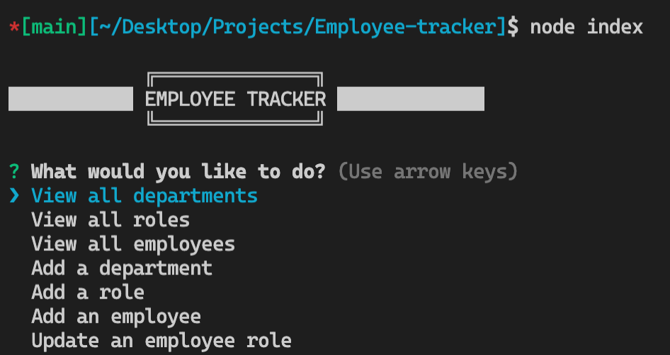

# Employee-tracker

 

 

<h1> 

 Click the image below to view my youtube walkthrough of the employee tracker 

</h1>

 

<!-- ABOUT THE PROJECT -->
## About The Project

 

    Using SQL, node.js, inquirer npm, and console.table() to view and manage the departments, roles, and employees in a company

 

 

### Installation 

- Once you have the repository cloned, you can open your CLI and type `my sql -u <username> -p`
- From here you can enter your mySQL password

- Run `source db/db.sql` which uses the 'company_db' database
- Run `source db/schema.sql` which populates the database with the table format
- Run `source db/seeds.sql` which populates the tables with data
- Run `node index` to begin the application!

